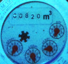
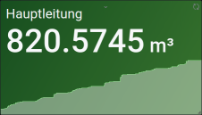

# Read a water meter and returns value

Reads analog water meters and provides a web service that returns the read value as decimal.

Turns  into ```820.5745``` so it can become .

[](https://github.com/nohn/watermeter/actions/workflows/ci.yml?query=branch%3Amain) [](https://hub.docker.com/r/nohn/watermeter/tags?page=1&ordering=last_updated)

## Getting Started

To get a benefit from using this software, you need at least three components. It is strongly encouraged to run each of these components in a different container or VM.

1. Something to take photos of your analog water meter. I use a Raspberry Pi Zero with a Raspberry Camera for that. Your image may need some post-processing. See the end of this README for some tips on that.
2. *This tool* to process that image into a decimal value
3. Something to process that value into whatever you like to do with it (charts, alerts, ...). I use [Home Assistant](https://home-assistant.io) for that.

### Installation

This only covers setting up watermeter. Please refer to the internet for setting up a camera or setting up Home Assistant.

#### Docker Compose

```yaml
version: "3.5"
services:
  watermeter:
    image: nohn/watermeter:latest
    container_name: watermeter
    volumes:
      - ./watermeter/config:/usr/src/watermeter/src/config
    restart: always
    ports:
      - "3000:3000"
```

#### Configuration

Once you have found your way to take images of your water meter, you can access the configuration tool http://ip:3000/configure.php. The interface should be self explanatory.


After configuration is done, you can access the current value at

    http://ip:3000/

or

    http://ip:3000/?json

or see debug information at

    http://ip:3000/?debug

#### Integration in Home Assistant

In your ```configuration.yaml``` add

```yaml
sensor:
  - platform: rest
    name: Water
    resource: "http://watermeter:3000/"
    scan_interval: 60
    unit_of_measurement: 'm³'
```

## How to contribute

You can contribute to this project by:

* Opening an [Issue](https://github.com/nohn/watermeter/issues) if you found a bug or wish to propose a new feature
* Placing a [Pull Request](https://github.com/nohn/watermeter/pulls) with bugfixes, new features etc.

## You like this?

Consider a [gift](https://www.amazon.de/hz/wishlist/genericItemsPage/3HYH6NR8ZI0WI).

## License

analogmeterreader is released under the [GNU Affero General Public License](LICENSE).

## Taking the water meter image

I have good results with a Raspberry Pi Zero, a cheap Raspberry camera and a white LED connected to one of the GPIOs. There are tons of tutorials out there, how to connect a LED to your Raspberry PI.  

In fact the worse the image quality, the easier it is for the OCR to read the digits in my experience. To see an example, how bad the quality can be, take a look at the [demo image](src/demo/demo.jpg). Sometimes when the meter is fogged, the quality is even worse, but the results are still accurate.

Night vision cameras do not provide good results, as it's close to impossible to identify the analog gauges with a greyscale image.

```python
from gpiozero import LED
from time import sleep
from picamera import PiCamera

led = LED(17) # My LED is connected to GPIO 7 (3,3 V on a Zero)
    
camera = PiCamera()
camera.resolution = (2592, 1944)
camera.brightness = 60
# Turn on LED
led.on() 
# Turn on Camera and allow to adjust to brightness
camera.start_preview()
sleep(5)
# Take an image. I put in in /run/shm to not wear the SD card
camera.capture('/run/shm/wasseruhr_last.jpg')
camera.stop_preview()
led.off()
```

### Preprocessing the meter image

Your mileage may vary, you have to play around a bit. I run

    convert -contrast -equalize /run/shm/wasseruhr_crop.jpg /run/shm/wasseruhr.jpg

for equalizing the results and improving contrast.

### Serving the meter image

I server the image from /run/shm and don't log access to reduce SD card wearing:

	root /run/shm;
    access_log /dev/null;

