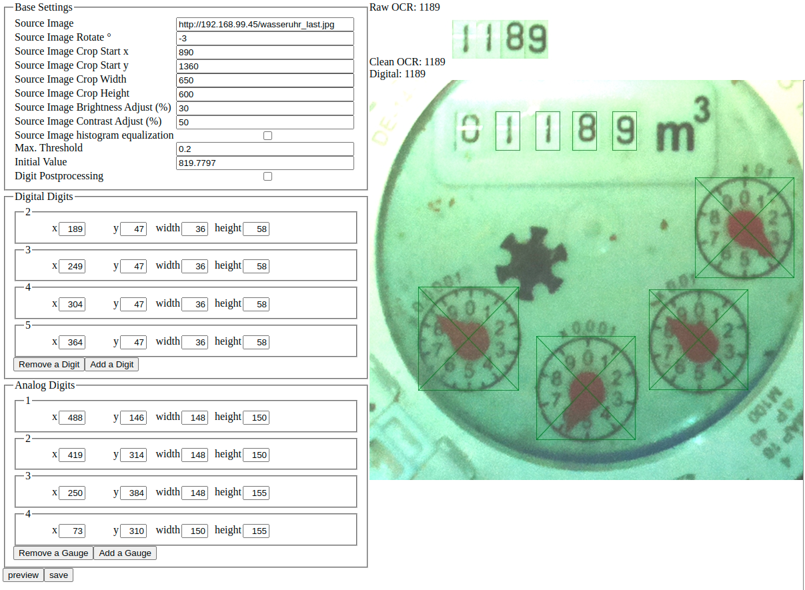

# Read a water meter and returns value

Reads analog water meters and provides a web service that returns the read value as decimal.

Turns  into ```820.5745``` so it can become .

[](https://github.com/nohn/watermeter/actions/workflows/ci.yml?query=branch%3Amain) [](https://hub.docker.com/r/nohn/watermeter/tags?page=1&ordering=last_updated)

## Getting Started

### Installation

This only covers setting up watermeter. A more extensive documentation can be found in [the howto](doc/HOWTO.md).

#### Using Docker Compose (recommended)

```yaml
version: "3.5"
services:
  watermeter:
    image: nohn/watermeter:latest
    container_name: watermeter
    volumes:
      - ./watermeter/config:/usr/src/watermeter/src/config
    restart: always
    ports:
      - "3000:3000"
```

### Configuration

You can access the configuration tool http://watermeter:3000/configure.php. The interface should be self explanatory. Source Image can be either in local filesystem or any HTTP(S) resource.



After configuration is done, you can access the current value at

    http://watermeter:3000/

or

    http://watermeter:3000/?json

or see debug information at

    http://watermeter:3000/?debug

## How to contribute

You can contribute to this project by:

* Opening an [Issue](https://github.com/nohn/watermeter/issues) if you found a bug or wish to propose a new feature
* Placing a [Pull Request](https://github.com/nohn/watermeter/pulls) with bugfixes, new features etc.

## You like this?

Consider a [gift](https://www.amazon.de/hz/wishlist/genericItemsPage/3HYH6NR8ZI0WI).

## License

analogmeterreader is released under the [GNU Affero General Public License](LICENSE).