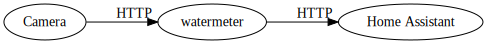
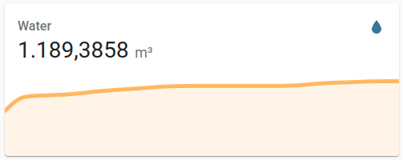

# How to turn your analog water meter into a Home Assistant sensor

## Overview

The system contains of three components that communicate via HTTP:

* Camera
* watermeter
* Home Assistant



## Taking a photo of your water meter

You can use any camera you like as long as it shoots color images. Night vision cameras do not provide good results, as it's close to impossible to identify the analog gauges with a greyscale image. In this example, I use a standard camera and a white LED for illumination when taking photos:

* A Raspberry Pi Zero W running Raspberry OS
* A cheap Raspberry Pi camera
* A bright white 3.3V LED connected to GPIO 17

The script taking care of driving the LED and the camera is run from cron:

```python
from gpiozero import LED
from time import sleep
from picamera import PiCamera

led = LED(17) # LED is connected to GPIO 17 (3,3 V on a Zero)
    
camera = PiCamera()
camera.resolution = (2592, 1944)
camera.brightness = 60
# Turn on LED
led.on() 
# Turn on Camera and allow to adjust to brightness
camera.start_preview()
sleep(5)
# Take an image. I put in in /run/shm to not wear the SD card
camera.capture('/run/shm/watermeter_last.jpg')
camera.stop_preview()
led.off()
```

Images are stored in /run/shm to not wear the SD card.

## Serving the meter image

The image is served from /run/shm using NGINX with disabled access logging to reduce SD card wearing.

* Install nginx via ```sudo apt install ngnix```
* In ```/etc/nginx/nginx.conf``` change ```access_log /var/log/nginx/access.log;``` to ```access_log /dev/null;```
* In ```/etc/nginx/sites-enabled/default``` change ```root /var/www/html``` to ```root /run/shm;```
* Restart nginx via ```sudo systemctl restart nginx.service```

## Processing your photo to data using watermeter

### General Considerations

I recommend to run it on a x86_64 machine, but a Raspberry Pi 3 should be sufficient. Lower powered devices like a Raspberry Pi Zero may also work, but I've never tested that.

### Running watermeter with Docker Compose

The following example requires a running docker-compose setup. On Debian based systems install via ```sudo apt install docker-compose docker.io```. I recommend to enable docker service to start on boot with ```sudo systemctl enable docker```. You may also want to add your user to the docker group: ```sudo addgroup YOURUSER docker```.

The ```docker-compose.yaml``` for running watermeter looks like this:

```yaml
version: "3.5"
services:
  watermeter:
    image: nohn/watermeter:latest
    container_name: watermeter
    volumes:
      - ./watermeter/config:/usr/src/watermeter/src/config
    restart: unless-stopped
    ports:
      - "3000:3000"
```

1. create the config directory using ```mkdir  -p watermeter/config```
2. put a default config in there: ```curl https://raw.githubusercontent.com/nohn/watermeter/main/src/config/config.php -o watermeter/config/config.php```.
3. start watermeter with ```docker-compose pull && docker-compose up -d```.

### Configuration

After watermeter has started, you can access the configuration UI at http://ip.of.docker.host:3000/configure.php


Replace "Source Image" with http://ip.of.camera.pi/watermeter.jpg and hit the "preview" button. Now, step by step enter the coordinates of your digits and gauges and verify with "preview". You also need to change the value in "Initial Value" to whatever your meter currently reads.

If required, you can rotate, crop, qualize the image and adjust brightness and contrast. Aim of the image enhancement is to make the digits look as flat as possible and the gauges to look as red as possible and to enhance overall contrast to the maximum possible. 

Once you are done, click the "save" button to save your configuration.

Verify the results by accessing http://ip.of.docker.host:3000/?debug.

If the digits and gauges are placed correctly, but the results are wrong, please try different options for enhancing the image (see above).

Once you are happy with the results, you can access the plain number on http://ip.of.docker.host:3000/.

## Adding a sensor to Home Assistant

You need a running Home Assistant instance. Please referer to [https://www.home-assistant.io/installation/](https://www.home-assistant.io/installation/) for installation instructions. I strongly recommend _not to run it on a Raspberry Pi and <b>definitly not on a SD card</b>_. Home Assistant is constantly writing to disk and will wear any SD card within a few months. I recommend using some cheap and low power x86_64 machine with a SSD for that.  

Once you have set up your Home Assistant, please add this to your configuration.yaml: 

```yaml
sensor:
  - platform: rest
    name: Water
    resource: "http://ip.or.hostname.of.watermeter:3000/"
    scan_interval: 60
    unit_of_measurement: 'm³'
```

And restart Home Assistant.

After that you should have a new sensor call "Water".



## How to contribute

You can contribute to this project by:

* Opening an [Issue](https://github.com/nohn/watermeter/issues) if you found a bug or wish to propose a new feature
* Placing a [Pull Request](https://github.com/nohn/watermeter/pulls) with bugfixes, new features etc.

## You like this?

Consider a [gift](https://www.amazon.de/hz/wishlist/genericItemsPage/3HYH6NR8ZI0WI).

## License

watermeter is released under the [GNU Affero General Public License](LICENSE).
